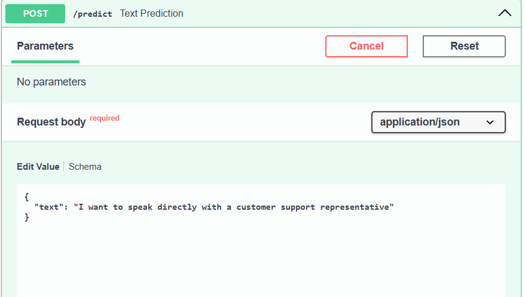
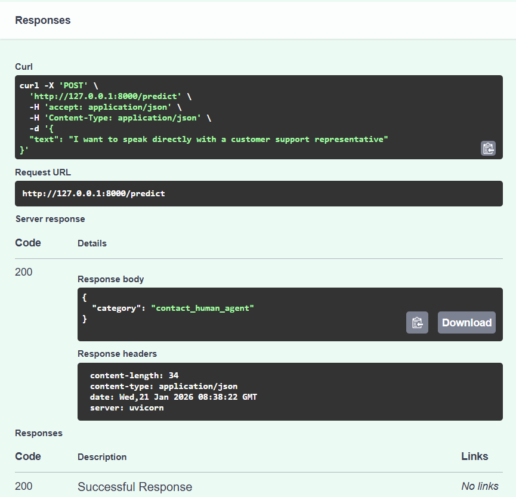

# Business Optima Assignment

### Overview 
- From all the given task option i have chosen the Option 1 : Smart Text Classifier
- This assignment categorizes customer support message into predifined business-related categories

### Dataset

``` https://www.kaggle.com/datasets/scodepy/customer-support-intent-dataset/data ```
- This is the dataset i have taken subset of 5 categories and implemented
- Categories : 'change_order', 'change_shipping_address', 'check_refund_policy', 'contact_human_agent', 'delivery_period'

### Approach :

The solution demonstrate an end-to-end NLP pipeline including:
- Data preprocessing and exploration
- Text Vectorization using TF-IDF
- Model training and evaluation
- Deployment via a FastAPI

### Evaluation Metrics :

The following metrics were used to evaluate model performance
- Accuracy
- Precision
- Recall
- F1-Score
- Confusion Matrix

### API Implementation

Framework 
- FastAPI
- Pydantic for request/response validation

### Endpoint 

``` POST /predict ```

### Request Body



### Response Body




### How to Run 
- Install Dependencies
  ``` pip install -r requirements.txt ```

- Start the API
  ``` uvicorn app:app --reload ```

- Open Swagger UI
  ``` http://127.0.0.1.8000/docs ```

### Example Sentences
- I want to add another item to my existing order

- How long will it take for my order to arrive?

- Under what conditions can I get a refund?

- I want to speak with a customer support agent

### Limitations 
- The dataset category values are about 40 for each category that may not fully represent real-world customer language
- TF-IDF is a lexical model and does not capture the semantic meaning

### Future Improvements
- Use contextual embeddings (ex: sentence-transfromers)
- Expand dataset with real-world customer quries
  
